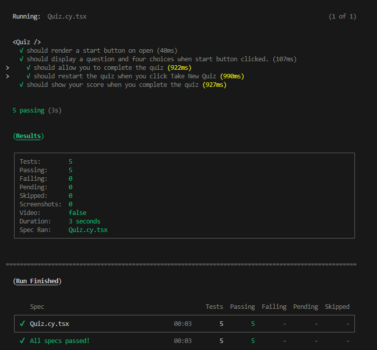
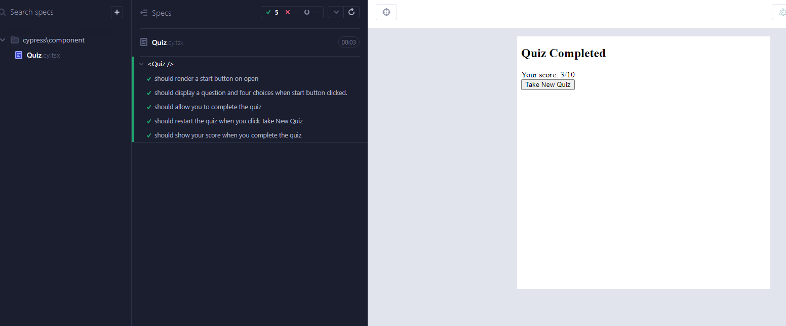

# Tech-Quiz_Test

## Description

This is an example of the Cypress test installed and running on a simple quiz app.

## Table Of Contents

1. [Installation](#installation)
2. [Usage](#usage)
3. [License](#license)
4. [Contribution Guidelines](#contribution)
5. [Tests](#tests)
6. [Questions](#questions)

## Installation

Download the files and run 'npm install' to install the required dependencies. Also make sure you update the .env file to allow for the database to be properly linked.

## Usage

You can run tests using a few scripts.

1.  'npm run test' - This runs tests in the terminal for the e2e and the components.
2.  
3.  'npm run cypress:e2e' - This opens the Cypress devtools and allows you to run the e2e tests in a more visual way.
4.  'npm run cypress:component' - This opens the Cypress devtools and allows you to run the component tests in a more visual way.
5.  

There is also a walkthrough video available at the following link:  
[Test walkthrough video]:https://drive.google.com/file/d/1wBZsmsYgQRqCIxy9mmAccWR2kfIrHMmO/view?usp=sharing

## License

None

## Contribution Guidelines

None

## Tests

None

## Questions

Feel free to reach out to me if you have any questions, or if you'd like to find out what else I've worked on. My details are as follows:  
 Github: https://github.com/BMcBryde3  
 Email: Brett.McBryde@yahoo.com
